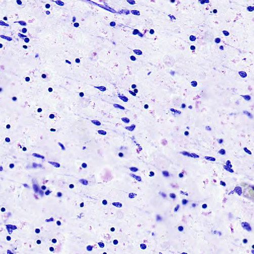

# NISSL-Cell-Detection
Detection of Cells in NISSL stained Brain images

<details>
  <summary> $${\color{magenta} Requirements}$$ </summary>

  + Python 3.7+
  + scikit-image
  + scikit-learn
  + matplotlib
  + pandas
  + pathlib
  + os
  + sys
  + shapely
  + numpy
  + $${\color{orange}KAKADU (!Optional) }$$
  
</details>


The package contains two files:
1. ```cell_functions_new_tiles.py ```
2. ```display_results.py ```

<details>
  <summary> $${\color{yellow}Running\ cell\_functions\_new\_tiles.py}$$ </summary>
  
  + $${\color{red}Input}$$: ```Image File (tiff/jp2)```
  
  + $${\color{green}Output}$$: ```CSV for the cell centers in the image```
  
  + $${\color{lightblue}Usage}$$: ``` python3 .\cell_functions_new_tiles.py .\test_image.tif ```
  
</details>

<details>
  <summary> $${\color{yellow}Running\ display\_results.py}$$ </summary>
  
  + $${\color{red}Input}$$: ```Image File (tiff/jp2)```, ```CSV for the cell centers in the image```
  
  + $${\color{green}Output}$$: ```Image with cell centers```
  
  + $${\color{lightblue}Usage}$$: ``` python3 .\display_results.py .\test_image.tif ```
  
</details>

## Description of the Algorithm

$${\color{red}Input}$$: ```Image File (tiff/jp2)```

To use JPEG-2000 encoded images, the temp folder must be created in the working directory.<br>
KAKADU (https://kakadusoftware.com/) is required for decoding JPEG-2000 ( _.jp2_ ) images. <br>

$${\color{green}Output}$$: ```CSV for the cell centers in the image```

### Pseudocode

+ read the image <br>
   
+ Calculate channel-mean <br>
    
+ Invert the image <br>
    
+ Binarize the Image based on OTSU <br>
    
+ Fill the small holes in the image < 16 pixels <br>
    
+ Remove small objects less than 40 pixels (these are assumed as not cells) <br>
    
+ Find the Connected Components
+ Connected components <= 75 pixels and > 40 pixels, are demarcated as singular cells
    
+ Connected components > 75 pixels are demarcated as overlapping cells
+ 
