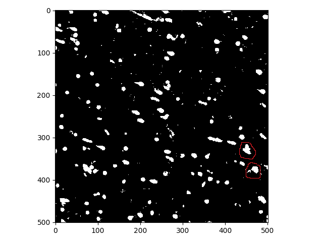

# NISSL-Cell-Detection

[](https://doi.org/10.5281/zenodo.14200087)

The nissl-stained sections in the brain label millions of granular cells, where the morphology of these cells is quite similar in shape and size. The cells are circular in nature in the brain. Applying state-of-the-art machine vision techniques, including Deep Learning techniques to identify these cells fail to capture all the cells individually. These algorithms also fail to decompose overlapping cells, due to their holistic segmentation approach. The semantic segmentation approach using Mask-RCNN used to segment the nissl cells,  fails to achieve satisfactory results in the brain regions with large number of granular cells. To overcome the bottleneck of the holistic approach of the recent segmentation techniques, we resort to traditional morphological-based operations to segment the complicated regions involving overlapping cells.

This morphological approach is effective in breaking the barriers of the recent holistic segmenter and pixel segmentation approach when the cells have similar morphological characteristics. This technique as shown in our approach is quite efficient in determining the cells with overlapping areas occluded or partially visible cellular structures. The approach is highly parallelizable and can be used as a tiled approach (moving window) to compensate for any intensity variation in the image.


<details>
  <summary> $${\color{magenta} Requirements}$$ </summary>

  + Python 3.7+
  + scikit-image
  + scikit-learn
  + matplotlib
  + pandas
  + pathlib
  + os
  + sys
  + shapely
  + numpy
  + $${\color{orange}KAKADU (!Optional) }$$
  
</details>


The package contains two files:
1. ```cell_functions_new_tiles.py ```
2. ```display_results.py ```

<details>
  <summary> $${\color{magenta}Running\ cell\_functions\_new\_tiles.py}$$ </summary>
  
  + $${\color{red}Input}$$: ```Image File (tiff/jp2)```
  
  + $${\color{green}Output}$$: ```CSV for the cell centers in the image```
  
  + $${\color{lightblue}Usage}$$: ``` python3 .\cell_functions_new_tiles.py .\test_image.tif ```
  
</details>

<details>
  <summary> $${\color{magenta}Running\ display\_results.py}$$ </summary>
  
  + $${\color{red}Input}$$: ```Image File (tiff/jp2)```, ```CSV for the cell centers in the image```
  
  + $${\color{green}Output}$$: ```Image with cell centers```
  
  + $${\color{lightblue}Usage}$$: ``` python3 .\display_results.py .\test_image.tif ```
  
</details>

## Description of the Algorithm

$${\color{red}Input}$$: ```Image File (tiff/jp2)```

To use JPEG-2000 encoded images, the temp folder must be created in the working directory.<br>
KAKADU (https://kakadusoftware.com/) is required for decoding JPEG-2000 ( _.jp2_ ) images. <br>

$${\color{green}Output}$$: ```Cell centers of the NISSL stained cells in the image```

### Algorithm 
_(Images used here are in assets folder)_

+ Read the image <br>
  <details>
    <summary> $${\color{blue}Show\ Image}$$ </summary>
    
    
    
  </details>
+ Calculate channel-mean <br>
  <details>
    <summary> $${\color{blue}Show\ Image}$$ </summary>
    
    
  
  </details>
+ Invert the image <br>
  <details>
    <summary> $${\color{blue}Show\ Image}$$ </summary>
    
    
  
  </details>
+ Binarize the Image based on OTSU <br>
  <details>
    <summary> $${\color{blue}Show\ Image}$$ </summary>
    
    
  
  </details>
+ Fill the small holes in the image < 16 pixels <br>
  <details>
    <summary> $${\color{blue}Show\ Image}$$ </summary>
    
    
  
  </details>
+ Remove small objects less than 40 pixels (these are assumed as not cells) <br>
  <details>
    <summary> $${\color{blue}Show\ Image}$$ </summary>
    
    
  
  </details>
+ Find the Connected Components
+ Connected components <= 75 pixels and > 40 pixels, are demarcated as singular cells with centroids as shown <br>
  <details>
    <summary> $${\color{blue}Show\ Image}$$ </summary>
    
    
  
  </details>
+ Connected components > 75 pixels are demarcated as overlapping cells, known as ```big_object```(s)
+ Find the number of discs of radius 4 pixels that can fit into each ```big_object```
+ Fit the same number of GMMs into each ```big_object``` representing multiple cells
+ The mean of each Gaussian in the centroid of each cell for the multi-cellular connected components, as shown <br>
  <details>
    <summary> $${\color{blue}Show\ Image}$$ </summary>
    
    

  </details>
+ Collect the centroids ```(x,y)``` of singular cells and overlapping cells into CSV output <br>
  <details>
    <summary> $${\color{blue}Show\ Image}$$ </summary>
    
    
  
  </details>
+ The final result of all these centroids gives all the cells in the Nissl stained image (Requires running of ```display_results.py```) <br>
  <details>
    <summary> $${\color{blue}Show\ Image}$$ </summary>
    
    
  
  </details>
  
